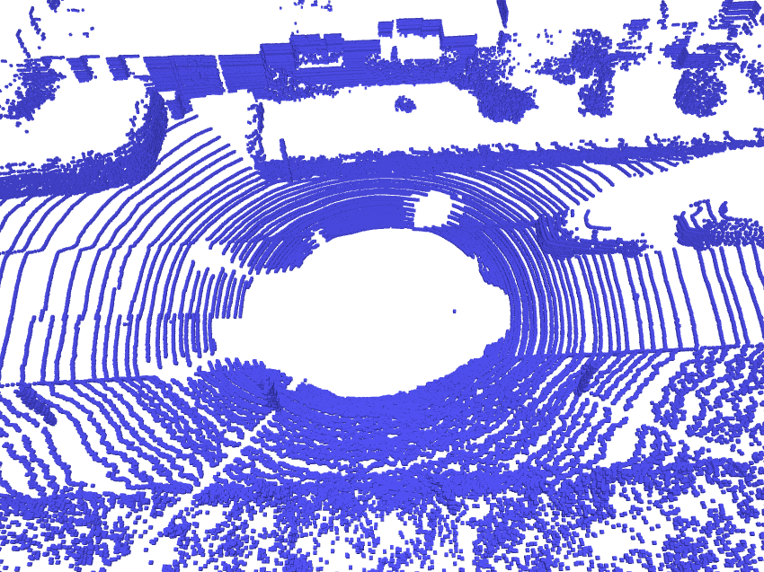

<div align="center">
  <h1 align="center">DiffSSC: Semantic LiDAR Scan Completion using Denoising Diffusion Probabilistic Models</h1>

  <p align="center">
    <a href="https://helincao618.github.io/">Helin Cao</a> and <a href=https://www.ais.uni-bonn.de/behnke/ target=_blank rel=noopener>Sven Behnke</a>
      <br>
      University of Bonn and Lamarr Institute, Bonn, Germany
    <br />
    <strong>IROS 2025</strong>
    <br />
    <a href="https://arxiv.org/abs/2409.18092">Arxiv</a> | <a href="https://sites.google.com/view/diffssc">Project page</a>
    <br />
  </p>
</div>

# Teaser



# Table of Content
- [Preparing](#preparing)
  - [Setup](#setup)  
  - [Datasets](#datasets)
- [Running](#running)
  - [Training](#training)
  - [Evaluation](#evaluation)
  - [Inference](#inference)
  - [Visualization](#visualization)
- [Citation](#citation)
- [License and Acknowledgement](#license-and-acknowledgement)

# Preparing

## Setup

We recommend you to use [anaconda](https://www.anaconda.com/) to manage dependencies. You may need to change the torch and cuda version according to your computer.

1. Create conda environment:
```
conda create --name diffssc python=3.8
conda activate diffssc
```

2. Please install [PyTorch](https://pytorch.org/): 
```
conda install pytorch=1.13.0 torchvision torchaudio pytorch-cuda=11.7 -c pytorch -c nvidia
```

3. Install the additional dependencies:
```
cd DiffSSC/
pip install -r requirements.txt
```

5. Installing MinkowskiEngine:
```
pip3 install -U MinkowskiEngine==0.5.4 --install-option="--blas=openblas" -v --no-deps
```

4. We use [dvis](https://github.com/SirWyver/dvis) for visualization, which is a lightweight but efficient tool with a web server. We recommend you to use another conda environment to visualize the result. 

```
conda create --name dvis python=3.8 requests matplotlib pyyaml tqdm imageio
conda activate dvis
pip install visdom
git clone git@github.com:SirWyver/dvis.git
cd dvis
pip install .
```

## Datasets

1. You need to download
  - The **Semantic Scene Completion dataset v1.1** (SemanticKITTI voxel data (700 MB)) from [SemanticKITTI website](http://www.semantic-kitti.org/dataset.html#download)
  -  The **KITTI Odometry Benchmark calibration data** (Download odometry data set (calibration files, 1 MB)) and the **RGB images** (Download odometry data set (color, 65 GB)) from [KITTI Odometry website](http://www.cvlibs.net/datasets/kitti/eval_odometry.php).
  - The dataset folder at **/path/to/semantic_kitti** should have the following structure:
    ```
    └── /path/to/semantic_kitti/
      └── dataset
        └── sequences
          ├── 00
          | ├── image_2
          | ├── labels
          | ├── velodyne
          | ├── voxels
          | ├── calib.txt
          | ├── poses.txt
          | └── times.txt
          ├── 01
          ...
    ```

2. Create a folder to store SemanticKITTI GroundTruth data at `/path/to/semantic_kitti/groundtruth/folder`.

```
python3 map_from_scans.py --/path/to/semantic_kitti/groundtruth/folder
```

# Scripts
All the scripts is controlled by the `/DiffSSC/diffssc/config/`


## Training
To train the diffusion model, adjust the configuration file at `config/config.yaml`, then start the training process with:

```
python train.py
```

For the refinement stage, use the configuration in `config/config_refine.yaml` and execute:

```
python train_refine.py
```

## Evaluation
Put the checkpoints in the `/path/to/kitti/logdir/trained_models/kitti.ckpt`, then run:
```
python evaluation.py
```

## Visualization
Please follow the guide of [dvis](https://github.com/SirWyver/dvis), you need to setup the server before running the script.
```
python visualization.py
```

## Citation
If you find this work or code useful, please cite our paper and give this repo a star :)
```
@inproceedings{cao2025diffssc,
  title = {{DiffSSC}: Semantic {LiDAR} Scan Completion using Denoising Diffusion Probabilistic Models},
  author = {Cao, Helin and Behnke, Sven},
  booktitle = {IEEE/RSJ Int. Conf. on Intelligent Robots and Systems (IROS)},
  year = {2025},
}
```

# License and Acknowledgement
DiffSSC is released under the [MIT license](./LICENSE). Our code follows several awesome repositories. We appreciate them for making their codes available to public.
- [LiDiff](https://github.com/PRBonn/LiDiff)
- [DVIS](https://github.com/SirWyver/dvis)
- [LMSCNet](https://github.com/astra-vision/LMSCNet)
- [SemanticKitti](https://github.com/PRBonn/semantic-kitti-api)